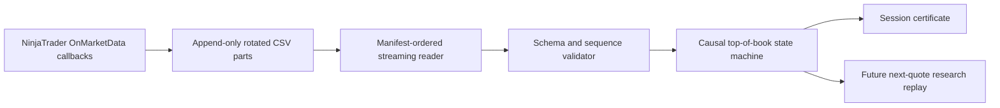

# Architecture

## Intended flow

## Trust boundaries

The raw event files are evidence. They must never be rewritten, merged, sorted, or
deduplicated in place. Any normalized output is a derived artifact with its own
manifest and hash.

The source timestamp describes the event, but physical callback order is the causal
ordering authority. Timestamp regressions are quality observations, not permission
to reorder rows.

## Components

### Recorder

`ninjatrader/CodexResearchDataRecorder.cs` assigns a v2 event ID before each Bid,
Ask, or Last callback is written. Its monotonic sequence continues across file
rotation; a restart creates a new run UUID.

### Reader

`iter_ninjatrader_event_exports()` is the ordering authority. It reads one CSV row
at a time, validates v2 identity and rotations, and never sorts by timestamp or
deduplicates by payload. `load_ninjatrader_event_exports()` is the materializing
pandas adapter for callers that still need a DataFrame.

### State machine

Bid and ask updates are independent. Each normalized event should expose the state
after applying that one event. A state is executable only when both sides have been
observed and ask is greater than bid.

### Session certifier

The certifier consumes raw-part manifests, control events, and normalized events. It
must fail closed and explain every rejection with stable machine-readable codes.

### Execution context

The disarmed bridge source is included only to document the eventual protocol
boundary. Order submission is outside the current review objective.
